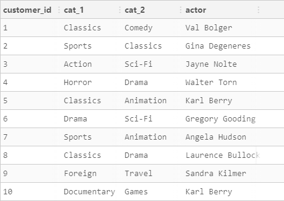
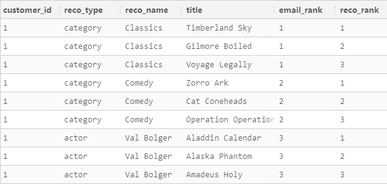
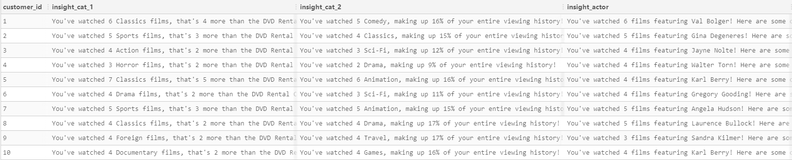

# Customer Insights and Film Recommendations for DVD Rental CO

## Introduction
With the rise of digital streaming services, traditional DVD rental businesses like DVD Rental CO need to leverage data analytics to stay competitive. This case study explores customer behavior by comparing their stats to average consumers and provides data-driven recommendations for new films based on their watch history. The aim is to enhance customer satisfaction and increase rental frequency through personalized film suggestions sent via email.

## Objectives
1. Analyze customer watch history to extract key insights.
2. Compare customer statistics with industry averages to identify trends and gaps.
3. Provide personalized film recommendations based on customers' watch history.
4. Offer strategic recommendations to enhance customer engagement and rental frequency.

## Methodology
This case study utilizes a data-driven approach, incorporating quantitative methods. Data sources include:
- **Customer Watch History**: Analysis of watch history data to identify frequently watched categories and most-watched actors.
- **Industry Reports**: Comparison of DVD Rental CO's customer statistics with industry averages to identify trends and gaps.
- **Recommendation Algorithm**: Use of collaborative filtering to generate personalized film recommendations based on the watch history of similar users.

## Analysis

1. **Customer Watch History**: An analysis of the watch history data revealed that customers tend to favor specific genres, with action and drama being the most popular.

2. **Comparative Statistics**: DVD Rental CO's customer statistics were compared internally to identify trends and gaps.

   - **Classics Films**: You've watched 6 Classics films, that's 4 more than the DVD Rental Co average and puts you in the top 1% of Classics Gurus!
   - **Comedy Films**: You've watched 5 Comedy, making up 16% of your entire viewing history!

3. **Personalized Insights**: Each customer's watch history was analyzed to identify their top 2 favorite categories and the most-watched actor.

4. **Recommendation Algorithm**: Using collaborative filtering, the recommendation system identified 3 new films for each of the top 2 categories and 3 new films featuring the most-watched actor that the customer has not yet watched.

## Results
#### Output 1: Display of Each Customer's First and Second Top Category and Actor Name

#### Output 2: Film and Actor Recommendations

#### Output 3: All Insights for Customers about Their Top 2 Categories and Actor

This approach aims to increase rental frequency by offering personalized and relevant film suggestions.

## Conclusion
By leveraging customer data, DVD Rental CO can gain deeper insights into customer preferences and enhance their rental service through personalized film recommendations. The findings support the implementation of a recommendation system to improve customer engagement and satisfaction.

## References
- Data provided by [Data with Danny](https://datawithdanny.com)
